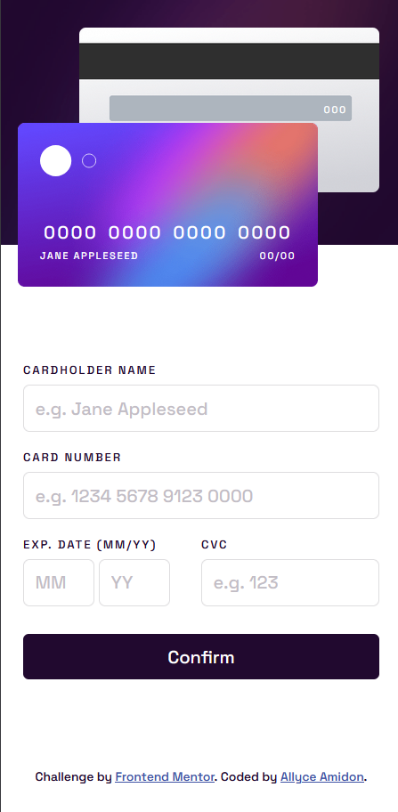

# Frontend Mentor - Interactive card details form solution

This is a solution to the [Interactive card details form challenge on Frontend Mentor](https://www.frontendmentor.io/challenges/interactive-card-details-form-XpS8cKZDWw). Frontend Mentor challenges help you improve your coding skills by building realistic projects. 

## Table of contents

- [Overview](#overview)
  - [The challenge](#the-challenge)
  - [Screenshot](#screenshot)
  - [Links](#links)
- [My process](#my-process)
  - [Built with](#built-with)
  - [What I learned](#what-i-learned)
  - [Useful resources](#useful-resources)
- [Author](#author)

## Overview

### The challenge

Users should be able to:

- Fill in the form and see the card details update in real-time
- Receive error messages when the form is submitted if:
  - Any input field is empty
  - The card number, expiry date, or CVC fields are in the wrong format
- View the optimal layout depending on their device's screen size
- See hover, active, and focus states for interactive elements on the page

### Screenshot




### Links

- Solution URL: [https://github.com/amidona/interactive-cc-form-fm](https://github.com/amidona/interactive-cc-form-fm)
- Live Site URL: [https://amidona.github.io/interactive-cc-form-fm/](https://amidona.github.io/interactive-cc-form-fm/)

## My process

### Built with

- Semantic HTML5 markup
- CSS custom properties
- Flexbox
- Mobile-first workflow

### What I learned

Getting the card images to line up with the text fields, overlapping certain areas while still maintaining legibility was a little tricky, but I got there in the end. This was a project I put down for a while and then came back to, so I think this was the first time I'd working in absolute positioning in such an exacting way (as opposed to, say, a menu pop-up modal).


```css
#back {
    background: url("images/bg-card-back.png");
    background-repeat: no-repeat;
    background-size: contain;
    height: 150px;
    margin: 25px 15px 0 70px;
    max-width: 280px;
    position: absolute;
    width: 75%;
}

#back .card-details {
    padding: 68px 0 0 220px;
}

#front {
    background: url("images/bg-card-front.png");
    background-size: contain;
    background-repeat: no-repeat;
    display: flex;
    flex-wrap: wrap;
    height: 150px;
    justify-content: space-between;
    margin-left: 15px;
    max-width: 280px;
    padding: 20px;
    position: absolute;
    top: 110px;
    width: 75%;
    z-index: 1;
}

#front img {
    padding-bottom: 30px;
    width: 60%;
}
```


### Useful resources

- [Automatically add a Dash or Hyphen after Every 3rd Character Using JavaScript](https://www.encodedna.com/javascript/how-to-add-dash-after-every-3rd-character-using-javascript-or-jquery.htm) - This was hugely helpful as an explanation and also the most straightforward rendering of adding the spaces between numbers within a form field (he used hyphens in his example) that I ran across.

## Author

- Website - [Allyce Amidon](https://allyceamidon.com/)
- Frontend Mentor - [@amidona](https://www.frontendmentor.io/profile/amidona)
- GitHub - [@amidona](https://github.com/amidona)

